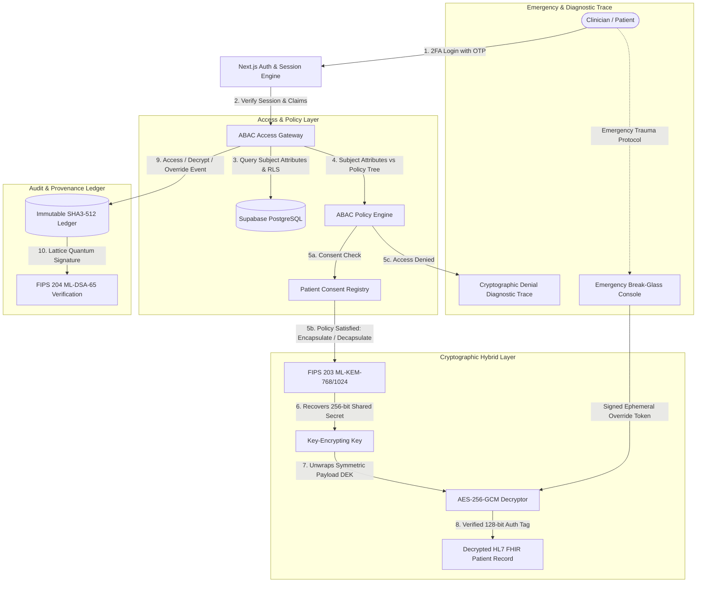

# PQ-ABAC-EHR: Post-Quantum Attribute-Based Access Control for Electronic Health Records

[](https://nextjs.org/)
[](https://www.typescriptlang.org/)
[](https://csrc.nist.gov/pubs/fips/203/final)
[](https://csrc.nist.gov/pubs/fips/204/final)
[](https://csrc.nist.gov/publications/detail/sp/800-38d/final)
[](https://supabase.com/)
[](https://www.hhs.gov/hipaa/for-professionals/security/index.html)

An end-to-end, production-grade cryptographic platform implementing **FIPS 203 ML-KEM-768/1024** lattice key encapsulation, Grover-resistant **AES-256-GCM** payload encryption, **FIPS 204 ML-DSA-65** lattice digital signatures, persistent **Two-Factor OTP Authentication**, a **Patient Self-Service Consent Portal**, and fine-grained **Attribute-Based Access Control (ABAC)** for Electronic Health Records adhering to the **HL7 FHIR** standard.

---

## 🏛️ System Architecture



---

## 🔐 Core Cryptographic Specifications

| Security Domain | Standard / Primitive | Parameter / Key Size | Quantum Threat Mitigated |
| :--- | :--- | :--- | :--- |
| **Post-Quantum KEM (Standard)** | **FIPS 203 ML-KEM-768** | $k=3, q=3329$, 1,184B PK, 1,088B CT | Shor's Algorithm / Harvest-Now-Decrypt-Later (HNDL) |
| **High-Security KEM (Category 5)** | **FIPS 203 ML-KEM-1024** | $k=4, q=3329$, 1,568B PK, 1,568B CT | Quantum Exhaustive Search & Cryptanalysis |
| **Symmetric Payload Encryption** | **AES-256-GCM** | 256-bit DEK, 96-bit IV, 128-bit Auth Tag | Grover's Quantum Search ($2^{128}$ post-quantum security) |
| **Digital Signatures** | **FIPS 204 ML-DSA-65** | Lattice MSIS, 1,952B PK, 3,309B Sig | Quantum Forgery & Signature Tampering |
| **Ledger Hash Chain** | **SHA3-512 Chain** | Keccak-p[1600, 24] Permutation, 64B Digest | Hash Collision & Classical Pre-image Attacks |
| **Authentication & 2FA** | **Persistent Login OTP** | 6-Digit Time-Bound Nonce + Session Cookie | Credential Stuffing & Session Hijacking |

---

## ✨ Key Features & Modules

### 1. 🛡️ Post-Quantum Envelope Encryption
- **Dual-Layer Envelope**: Combines FIPS 203 Module-Lattice KEM for post-quantum key exchange with hardware-accelerated AES-256-GCM for clinical payload confidentiality and authenticity.
- **Harvest-Now-Decrypt-Later (HNDL) Defense**: Guarantees that intercepted clinical traffic cannot be decrypted by future cryptanalytically relevant quantum computers (CRQCs).

### 2. 🌳 Granular Attribute-Based Access Control (ABAC)
- **Multi-Attribute Evaluation**: Access decisions are computed dynamically against:
  - `Role` (`Oncologist`, `ER_Physician`, `Triage_Nurse`, `Epidemiologist`, `Patient`)
  - `Department` (`Oncology`, `Emergency`, `Research`, `General_Medicine`)
  - `Clearance Level` (`Tier-1`, `Tier-2`, `Tier-3`)
  - `Organization / Hospital Affiliate`
  - `Patient Consent Directives`
- **Cryptographic Denial Trace**: When access is rejected, the engine generates an explanatory diagnostic audit explaining exact rule failures without leaking sensitive patient data.

### 3. 👤 Patient Self-Service & Consent Portal (`/portal/patient`)
- **Direct Patient Control**: Patients can review their encrypted health records, inspect real-time access audit logs showing who viewed their medical history, and grant or revoke clinician consent with instant effect.
- **Privacy-Preserving**: Ensures HIPAA and GDPR compliance by giving patients full autonomy over their sensitive records.

### 4. 🚨 Emergency "Break-Glass" Console (`/break-glass`)
- **Trauma & Resuscitation Override**: When patients present in critical conditions (unconscious, code blue, life-threatening trauma), authorized clinicians can execute an emergency override.
- **Audited Justification**: Generates a single-use, time-bound emergency override token, decrypts critical vitals/allergies, and writes an unforgeable high-severity event to the immutable audit ledger.

### 5. 🔑 2FA Login with OTP Verification (`/login`, `/api/auth`)
- **Dynamic 6-Digit Verification**: Secure two-factor authentication for both medical personnel and patients.
- **Turnkey Offline & Online Modes**: Dispatches real OTP emails via Resend when configured, or outputs live codes to the terminal console / demo banner for effortless local testing.
- **Persistent Sessions**: Secure, client-state and cookie-backed persistence across reloads.

### 6. 📜 Immutable Audit Ledger & Lattice Signatures (`/audit`)
- **Cryptographically Chained**: Every view, creation, decryption denial, and break-glass invocation is chained using SHA3-512 hashes ($H_i = \text{SHA3-512}(H_{i-1} \parallel \dots)$).
- **Post-Quantum Integrity Verification**: One-click verification scans the full chain and validates FIPS 204 ML-DSA-65 signatures to guarantee zero tampering or deletion.

### 7. 📊 PQC Governance & Benchmarks (`/keys`)
- **Multi-Authority Hierarchy**: View decentralized authority public keys (Hospital CA, Licensing Board, Consent Registry).
- **PQC vs Classical Telemetry**: Comparative metrics between classical RSA-2048 / ECC P-256 and PQC ML-KEM / ML-DSA.
- **In-Browser Microbenchmarks**: Run live Module-LWE encryption/decryption benchmarks measuring real-time latency and throughput.
- **Dynamic Attribute Revocation**: Instantly revoke clinician clearance or attributes and observe real-time policy rejection.

---

## 📁 Repository Structure

```text
post_quantum/
├── src/
│   ├── app/
│   │   ├── api/
│   │   │   └── auth/
│   │   │       ├── send-login-otp/       # Generates & dispatches 6-digit login OTP
│   │   │       └── verify-login-otp/     # Validates OTP & establishes secure session
│   │   ├── audit/                        # SHA3-512 & ML-DSA-65 audit ledger viewer
│   │   ├── break-glass/                  # Emergency trauma override console
│   │   ├── dashboard/                    # Clinician EHR viewer & ABAC decryptor
│   │   ├── keys/                         # Key telemetry, authority status & benchmarks
│   │   ├── login/                        # 2FA Login with demographic presets
│   │   ├── portal/
│   │   │   └── patient/                  # Patient consent & record viewer portal
│   │   ├── records/
│   │   │   └── new/                      # Create & encrypt new FHIR EHR documents
│   │   ├── layout.tsx                    # Root layout with ClientProviders & Navbar
│   │   └── page.tsx                      # Landing page with interactive architecture overview
│   ├── components/
│   │   ├── ClientProviders.tsx           # Global AuthContext & state provider
│   │   ├── Navbar.tsx                    # Top navigation bar with persona switcher
│   │   └── Footer.tsx                    # Standardized compliance & system footer
│   ├── context/
│   │   └── AuthContext.tsx               # Authentication, user attributes & session state
│   ├── lib/
│   │   ├── abac.ts                       # ABAC policy evaluation engine & denial diagnostics
│   │   ├── audit.ts                      # SHA3-512 hash chain & audit record generation
│   │   ├── fhir.ts                       # HL7 FHIR demographic & clinical record models
│   │   ├── kem.ts                        # FIPS 203 ML-KEM-768/1024 & AES-256-GCM crypto
│   │   ├── mldsa.ts                      # FIPS 204 ML-DSA-65 digital signature suite
│   │   ├── storage.ts                    # Local cache & Supabase persistence synchronizer
│   │   └── supabase.ts                   # Supabase client & credentials initialization
├── schema.sql                            # Complete PostgreSQL DDL, RLS, and triggers
├── .env.example                          # Sample environment configuration
├── package.json                          # Dependencies & npm scripts
└── README.md                             # Comprehensive technical documentation
```

---

## 🚀 Quick Start Guide

### Prerequisites
- **Node.js**: `v20.x` or `v22.x` (LTS recommended)
- **npm**: `v10.x` or higher

### 1. Clone & Install
```bash
git clone https://github.com/siddartha8659/post_quantum.git
cd post_quantum
npm install
```

### 2. Run Locally (Zero-Config Offline Mode)
The application includes a built-in cryptographic seed and local persistence layer, allowing you to run and evaluate all features immediately without external database dependencies:

```bash
npm run dev
```

Open [http://localhost:3000](http://localhost:3000) in your web browser.

---

## ⚙️ Production Supabase & Email Setup

To connect live Supabase PostgreSQL and email notifications:

### 1. Create a Supabase Project
1. Visit [supabase.com](https://supabase.com) and create a project.
2. Navigate to **Project Settings > API** to locate your **Project URL**, **Anon Key**, and **Service Role Key**.

### 2. Configure Environment Variables
Create `.env.local` based on `.env.example`:

```bash
cp .env.example .env.local
```

Fill in your configuration:
```env
# Supabase Configuration
NEXT_PUBLIC_SUPABASE_URL=https://your-project-id.supabase.co
NEXT_PUBLIC_SUPABASE_ANON_KEY=your-anon-public-key
SUPABASE_SERVICE_ROLE_KEY=your-service-role-secret-key

# Email Dispatch Configuration (Optional - for real email OTPs)
RESEND_API_KEY=re_your_resend_api_key

# Master Cryptographic Seed (Optional - 64-byte hex string)
PQC_MASTER_AUTHORITY_SEED=
```

### 3. Execute Database Migration
1. Go to your Supabase Project dashboard and open the **SQL Editor**.
2. Copy and paste the entire contents of [`schema.sql`](./schema.sql).
3. Click **Run**. The script will provision:
   - `profiles`: Clinician and patient attributes, clearance levels (Tier 1–3), and revocation flags.
   - `ehr_records`: Enveloped AES-256-GCM ciphertexts, 12-byte IVs, 16-byte tags, ML-KEM ciphertexts, and JSON ABAC policies.
   - `emergency_break_glass_events`: Override tokens and trauma justification records.
   - `audit_logs`: Immutable security ledger chained by SHA3-512 hashes.
   - `key_authorities`: Decentralized authority public keys.
   - **PostgreSQL Immutability Trigger**: Strictly prohibits any `UPDATE` or `DELETE` on the audit ledger.
   - **Row Level Security (RLS)**: Enforces database-level isolation.

---

## 🧪 Interactive Testing Walkthrough

### 1. Test Personas (`/login`)
Use the quick-select demographic presets to switch between access privileges:
| Persona | Role | Department | Clearance | Typical Authorized Scope |
| :--- | :--- | :--- | :--- | :--- |
| **Dr. Sarah Rao** | `Oncologist` | `Oncology` | `Tier-3` | High-security genomic panels & chemotherapy protocols |
| **Nurse Alex** | `Triage_Nurse` | `Emergency` | `Tier-1` | Triage vitals, basic allergy profiles, emergency records |
| **Dr. Emergency John** | `ER_Physician` | `Emergency` | `Tier-2` | Trauma records & acute emergency evaluations |
| **Researcher Dave** | `Epidemiologist` | `Research` | `Tier-1` | De-identified epidemiological & research cohorts |
| **Eleanor Vance** | `Patient` | `General` | `Tier-1` | Self-service access & personal consent directives |

### 2. ABAC Decryption Flow (`/dashboard`)
1. Log in as **Dr. Sarah Rao** (`Tier-3`, `Oncology`).
2. Open `Oncology Genomic Panel & Chemotherapy Protocol (Stage IV)`.
3. The ABAC policy passes (`Department == 'Oncology' AND Clearance >= 3`). The system executes **ML-KEM-768 decapsulation**, unrolls the AES-256-GCM key, and renders the patient document with complete FHIR tabs (Demographics, Vitals, Medications, Allergies, Doctor Notes, Raw JSON).
4. Switch persona to **Nurse Alex** (`Tier-1`, `Emergency`).
5. Attempt to decrypt the same record. The engine produces a **Cryptographic Denial** modal displaying:
   - `Clearance Level Tier-1 < Required Tier-3`
   - `Department Emergency != Required Oncology`

### 3. Patient Consent Management (`/portal/patient`)
1. Log in as **Eleanor Vance** (`Patient`).
2. Access the Patient Portal to view all personal health records and real-time access logs.
3. Toggle consent permissions for specific clinical departments or practitioners.
4. Verify that revoked consent immediately blocks unauthorized clinician decryption on the clinician dashboard.

### 4. Emergency Break-Glass (`/break-glass`)
1. In urgent medical scenarios where the policy would normally deny access, navigate to `/break-glass`.
2. Select the target patient, specify trauma justification, attest to administrative audit, and trigger the override.
3. An ephemeral single-use override token is issued, critical life-support vitals and fatal allergies are revealed, and an unforgeable critical audit event is committed to the ledger.

### 5. Ledger Integrity Check (`/audit`)
1. Navigate to `/audit` to inspect the chronological stream of events.
2. Click **Verify Ledger Integrity**.
3. The system scans the entire chain, verifying that $\text{SHA3-512}(H_{i-1} \parallel \text{Payload}_i) == H_i$ and authenticating the ML-DSA-65 signature on each block.

---

## 📜 Standards & Compliance

- **NIST FIPS PUB 203**: Module-Lattice-Based Key-Encapsulation Mechanism (ML-KEM).
- **NIST FIPS PUB 204**: Module-Lattice-Based Digital Signature Standard (ML-DSA).
- **NIST SP 800-38D**: Recommendation for Block Cipher Modes of Operation: Galois/Counter Mode (AES-GCM).
- **NIST SP 800-162**: Guide to Attribute Based Access Control (ABAC) Definition and Considerations.
- **HL7 FHIR Release 4**: Fast Healthcare Interoperability Resources clinical data models.
- **HIPAA Security Rule (45 CFR § 164.312)**: Access Control (§ 164.312(a)), Audit Controls (§ 164.312(b)), Integrity Controls (§ 164.312(c)), and Transmission Security (§ 164.312(e)).

---

## 📄 License

This project is licensed under the **MIT License**.
