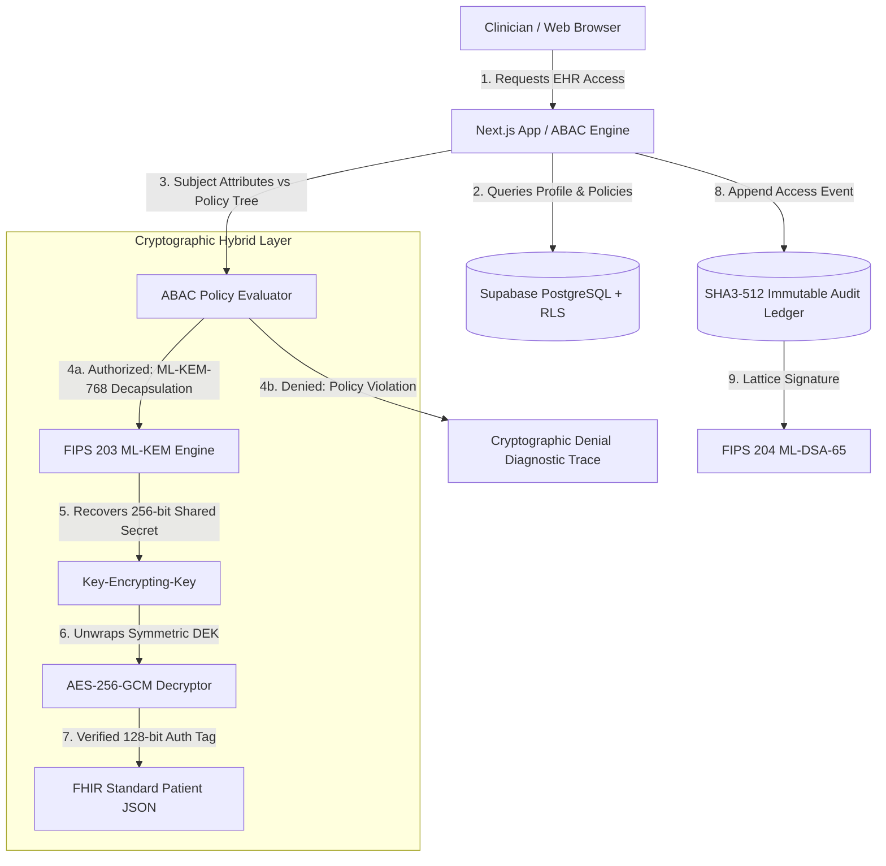

# PQ-ABAC-EHR: Post-Quantum Attribute-Based Access Control for Electronic Health Records

An end-to-end, production-grade cryptographic prototype implementing **FIPS 203 ML-KEM-768/1024** lattice key encapsulation, Grover-resistant **AES-256-GCM** payload encryption, **FIPS 204 ML-DSA-65** lattice digital signatures, and fine-grained **Attribute-Based Access Control (ABAC)** for Electronic Health Records (FHIR standard).

---

## 🏛️ System Architecture



### Core Cryptographic Specifications
| Security Domain | Standard / Primitive | Parameter / Key Size | Quantum Threat Mitigated |
| :--- | :--- | :--- | :--- |
| **Post-Quantum KEM** | **FIPS 203 ML-KEM-768** | $k=3, q=3329$, 1,184B PK, 1,088B CT | Shor's Algorithm / HNDL attacks |
| **High-Security KEM** | **FIPS 203 ML-KEM-1024** | $k=4, q=3329$, 1,568B PK, 1,568B CT | NIST Category 5 Quantum Attacks |
| **Symmetric Payload** | **AES-256-GCM** | 256-bit DEK, 96-bit IV, 128-bit Tag | Grover's Quantum Search ($2^{128}$ PQ security) |
| **Digital Signatures** | **FIPS 204 ML-DSA-65** | Lattice MSIS, 1,952B PK, 3,309B Sig | Quantum Forgery & Signature Tampering |
| **Ledger Integrity** | **SHA3-512 Hash Chain** | Keccak-p[1600, 24] Permutation, 64B Digest | Hash-collision & Classical Pre-image |

---

## 🚀 Quick Start Guide

### 1. Prerequisites
- **Node.js**: v20+ or v24+
- **npm**: v10+

### 2. Installation
```bash
git clone <repo-url> post_quantum
cd post_quantum
npm install
```

### 3. Run Locally (Turnkey Offline-First Mode)
The application is pre-configured with a transparent, high-fidelity local cache and seed demographic dataset so you can run and test **immediately** without setting up a remote database:

```bash
npm run dev
```

Open [http://localhost:3000](http://localhost:3000) in your browser.

---

## ⚙️ Supabase Production Setup & Migration

To connect live Supabase PostgreSQL, Authentication, and Storage:

### Step 1: Create Supabase Project
1. Go to [supabase.com](https://supabase.com) and create a new project.
2. Note your **Project URL** and **API Keys** from `Project Settings > API`.

### Step 2: Configure Environment Variables
Copy `.env.example` to `.env.local` and populate your credentials:

```bash
cp .env.example .env.local
```

Edit `.env.local`:
```env
# Supabase Project API URL
NEXT_PUBLIC_SUPABASE_URL=https://xxxxxxxxxxxxxxxxxxxx.supabase.co

# Supabase Public Anon Key
NEXT_PUBLIC_SUPABASE_ANON_KEY=eyJhbGciOiJIUzI1NiIsInR5cCI6IkpXVCJ9...

# Supabase Service Role Key (Keep secret)
SUPABASE_SERVICE_ROLE_KEY=eyJhbGciOiJIUzI1NiIsInR5cCI6IkpXVCJ9...
```

### Step 3: Run Database Migration
Open your Supabase Project dashboard, go to the **SQL Editor**, and paste the full contents of `schema.sql`.

This script automatically provisions:
1. `profiles`: Clinician demographic attributes, department, clearance level (Tier 1–3), and revocation state.
2. `ehr_records`: Enveloped AES-256-GCM ciphertexts, 12-byte IVs, 16-byte authentication tags, 1088-byte ML-KEM ciphertexts, and JSON ABAC access policies.
3. `emergency_break_glass_events`: Ephemeral trauma override tokens and justifications.
4. `audit_logs`: Immutable security audit ledger chained by SHA3-512 hashes.
5. `key_authorities`: Decentralized authority public keys and classical vs PQC telemetry.
6. **Immutability Trigger**: PostgreSQL trigger `enforce_audit_log_immutability()` strictly blocking `UPDATE` or `DELETE` on the audit ledger.
7. **Row Level Security (RLS)** policies ensuring clinical data isolation.

---

## 🧪 Application Walkthrough & Test Presets

### 1. Healthcare Portal Login (`/login`)
Use the **1-Click Demographic Presets** to test different access privileges:
* **Dr. Sarah Rao** — Role: `Oncologist` | Dept: `Oncology` | Clearance: `Tier-3` | Hospital: `Apex Health`
* **Nurse Alex** — Role: `Triage_Nurse` | Dept: `Emergency` | Clearance: `Tier-1` | Hospital: `Apex Health`
* **Dr. Emergency John** — Role: `ER_Physician` | Dept: `Emergency` | Clearance: `Tier-2` | Hospital: `Apex Health`
* **Researcher Dave** — Role: `Epidemiologist` | Dept: `Research` | Clearance: `Tier-1` | Hospital: `Regional Health`

### 2. Clinician Dashboard (`/dashboard`)
- **ABAC Decryption Simulator**:
  1. Log in as **Dr. Sarah Rao** and click **Evaluate & Decrypt** on `Oncology Genomic Panel & Chemotherapy Protocol (Stage IV)`.
  2. Notice that the ABAC policy matches (`Department == 'Oncology' AND Clearance >= 3`). The system runs ML-KEM-768 decapsulation, decrypts AES-256-GCM, and renders the patient record with full FHIR tabs (Demographics, Vitals, Medications, Allergies, Doctor Notes, Raw FHIR JSON).
  3. Now switch persona via the top-right navbar to **Nurse Alex** (`Tier-1`, `Emergency`).
  4. Attempt to decrypt the same Oncology record. Notice the **Cryptographic Denial** modal detailing missing attributes:
     - `Clearance Level Tier-1 < Required Tier-3`
     - `Department Emergency != Required Oncology`

### 3. Encrypt New EHR (`/records/new`)
- Create a realistic FHIR patient document.
- Define custom ABAC policy trees using combinators (`AND`, `OR`), operators (`==`, `!=`, `>=`, `<=`, `IN`), and clearance levels.
- Click **Encrypt & Envelop EHR Payload** to watch real-time client-side generation of a 256-bit symmetric DEK, AES-GCM encryption, ML-KEM-768 encapsulation, and ledger block chaining.

### 4. Emergency "Break-Glass" Console (`/break-glass`)
- High-urgency trauma override console for life-or-death resuscitation.
- Select target patient, specify trauma justification, attest to administrative sanction, and trigger override.
- An ephemeral emergency token is signed, vital triage and fatal allergy lists are decrypted, and an immutable high-severity entry is committed to the audit table.

### 5. PQC Governance & Telemetry (`/keys`)
- Inspect Multi-Authority root keys (Apex Health CA, Medical Licensing Board, Consent Registry).
- View the **PQC vs Classical Key Size Telemetry** comparison table.
- Click **Run PQC Microbenchmark** to measure real in-browser Module-LWE encapsulation and decapsulation throughput (ops/sec and latencies in milliseconds).
- **Dynamic Attribute Revocation**: Invalidate a clinician's attribute (e.g. revoke Dr. Sarah Rao's `clearanceLevel`) and verify that subsequent decryption queries are immediately rejected by the ABAC engine.

### 6. Immutable Security Audit Log (`/audit`)
- Real-time tabular stream of every access request, decryption attempt, policy denial, and break-glass event.
- Displays SHA3-512 block hash links ($H_i = \text{SHA3-512}(H_{i-1} \parallel \dots)$) and ML-DSA-65 signatures.
- Click **Verify Ledger Integrity** to traverse the entire chronological ledger and verify cryptographic provenance with zero bit tampering.

---

## 🔒 Security & Compliance
- **FIPS PUB 203**: Module-Lattice-Based Key-Encapsulation Mechanism Standard (ML-KEM).
- **FIPS PUB 204**: Module-Lattice-Based Digital Signature Standard (ML-DSA).
- **NIST SP 800-38D**: Recommendation for Block Cipher Modes of Operation: Galois/Counter Mode (GCM).
- **HIPAA Security Rule**: 45 CFR Part 164, Subpart C — Technical Safeguards (§ 164.312).
